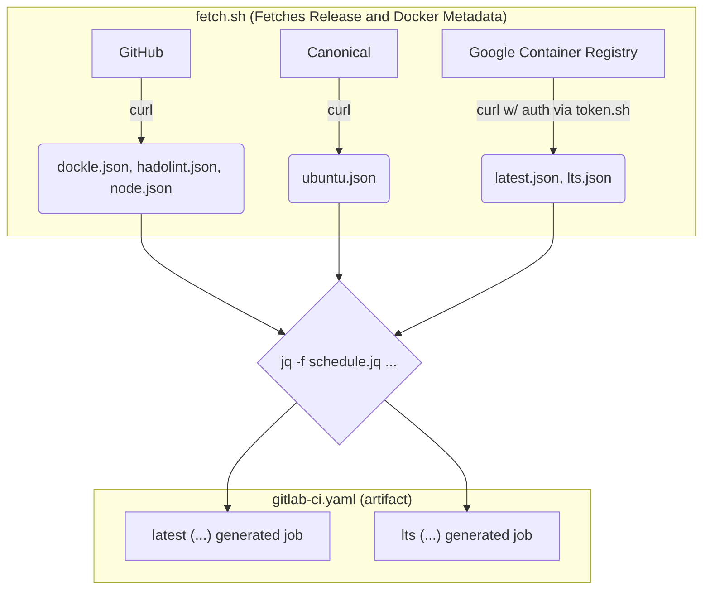

# Build Bundle Image

## CI Mechanism

## Introduction

Many projects at Sclable build on top of the Node.js stack (often times using
TypeScript). Generally, we want continous integration to support the
software development process by "building" a project every time its codebase
changes. By "building" we usually mean compiling, running unit tests,
linting of code, linting of commit messages, auditing dependencies, etc.

Some of these tasks require additional tools to be available in the execution
environment of CI jobs. By selecting a Docker image for CI jobs that provides
all these dependencies we can avoid reinstalling them over and over again
(once for each CI job that runs).

However, the standard images available on Docker Hub, do not provide this. The
`alpine` image is just bare bones, `java` allows us to run tools that depend on
the JVM, but does not contain Node.js, and similar reasoning applies to `node`
and `php` images.

Crafting a new image per project (based on any of the base images mentioned
above) which includes all dependencies means writing a custom `Dockerfile`,
and automating the process of building the image. Additionally, many projects
initially need a very similar set of tools to be built.

This is why we created our own "batteries included" Docker image, specifically
for use inside Sclable. It is called "build bundle".

At the time of writing the build bundle comes with different versions of
Node.js (8, 10, 12) and Java, as well as `git`, `curl` and `jq` in addition to
the SonarQube Scanner preinstalled. With this set of features we can kickstart
CI in many new projects, without thinking of how to manage another image.

### Available Tags

As of 2019-10, the template for tags is `build-bundle:node-v<version>`. The
image is being built for all current versions of Node.js, which are 8, 10 and
12 at the time of writing, so the available variants are:

- `build-bundle:node-v8`
- `build-bundle:node-v10`
- `build-bundle:node-v12`

Consider also the Node.js Release Schedule:

![Node.js Release Schedule Overview][node-releases]

## Using the Build Bundle

When declaring a job in `.gitlab-ci.yml`, specify to use `build-bundle:<tag>` as
the Docker image to use via the [`image`][gitlab-ci-image] configuration key.

## Changing the Build Bundle

The [`Dockerfile`][bb-dockerfile] for the build bundle is contained in [the
repository `sclable-platform/devops/build-bundle`][repo]. Merge requests
are welcome.

## Risks

If we want the build-bundle to accomodate ever more different project setups,
the image will need to incorporate a larger set of dependencies. There's some
risk that over time the build bundle gets annoyingly big. This risk should
be anticipated, and we might introduce different flavours of this image that
cover different kinds of projects.

## A Note on Sonar Scanner

`sonar-scanner-run.sh` is taken from
[`ciricihq/gitlab-sonar-scanner`](ciricihq-sonar-scanner).

[bb-dockerfile]: https://git.sclable.com/sclable-platform/devops/kubernetes-cluster/blob/master/build/build-bundle/Dockerfile
[gitlab-ci-image]: https://docs.gitlab.com/ee/ci/yaml/#image
[repo]: https://git.sclable.com/sclable-platform/devops/build-bundle/tree/master
[node-releases]: https://git.sclable.com/sclable-platform/devops/kubernetes-cluster/tree/master
[ciricihq-sonar-scanner]: https://github.com/ciricihq/gitlab-sonar-scanner/blob/b8bcc643df250ff69900719730af91966fa8a241/sonar-scanner-run.sh
